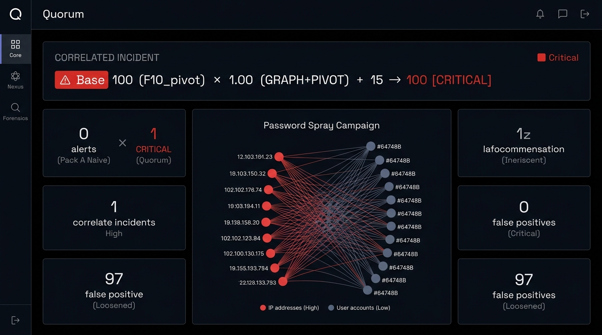
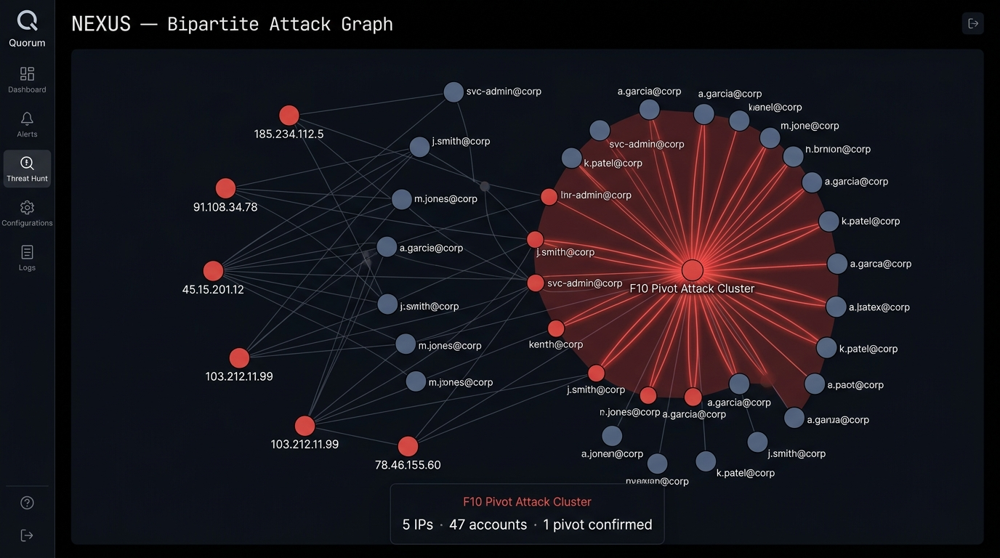
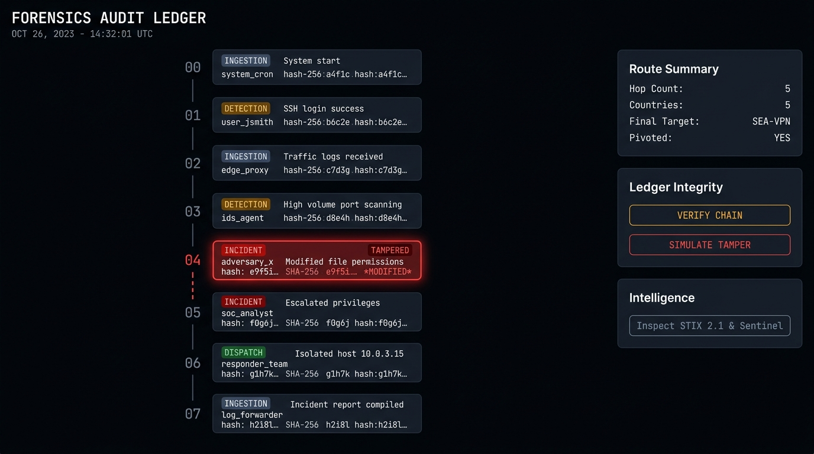

<div align="center">



<br /><br />

<h1>Quorum</h1>

<p><strong>Campaign-correlation detection for enterprise VPN authentication telemetry.</strong><br/>
Stop Midnight Blizzard–style distributed password sprays that bypass traditional SIEM threshold rules.</p>

[](https://github.com/yourusername/quorum/actions/workflows/ci.yml)
[](./tests)
[](./tsconfig.json)
[](https://nextjs.org)
[](./LICENSE)
[](https://microsoft.com)

</div>

---

## The 45-Second Demo Contrast

| Detector | Alerts | Result |
|---|---|---|
| **Naive Volume Rule** (>=5 failures/IP) | **0** | Complete miss — spray stays below threshold |
| **Loosened Threshold** (>=2 failures/IP) | **97** | SOC alert fatigue — floods analysts |
| **Quorum Consensus Engine** | **1 Correlated Critical** | `Base 100 (F10_pivot) x 1.00 (GRAPH+PIVOT) + 15 -> 100 [CRITICAL]` |

Quorum uses **bipartite graph Union-Find clustering** + **multi-family consensus arithmetic** to surface exactly one incident when Midnight Blizzard (NOBELIUM) operators distribute a password spray across 10 IPs and 47 accounts — staying under every per-source threshold.

---

## Screenshots

<table>
  <tr>
    <td align="center"><strong>Core SOC Console</strong></td>
    <td align="center"><strong>Nexus Bipartite Graph</strong></td>
  </tr>
  <tr>
    <td></td>
    <td></td>
  </tr>
  <tr>
    <td align="center" colspan="2"><strong>Forensics Audit Ledger</strong></td>
  </tr>
  <tr>
    <td colspan="2"></td>
  </tr>
</table>

---

## Architecture

```
+-------------------------------------------------------------------+
|                      QUORUM DETECTION PLANE                       |
|                                                                   |
|  Raw JSONL     F2 Normalizer    F5 Burst     F7 Bipartite        |
|  Auth Logs --> AuthEvent ------> Detector --> Graph Cluster      |
|                                               (Union-Find)        |
|                    F10 Pivot Detector <-----------+              |
|                         |                                         |
|                    F13 Multi-Family                               |
|                    Consensus Engine                               |
|                         |                                         |
|              Correlated Incident (score 0-115)                    |
|                         |                                         |
|          +--------------+------------------+                     |
|     F21 SHA-256                  F25 Export Suite                 |
|     Audit Ledger          STIX 2.1 . Sentinel . CSV              |
+-------------------------------------------------------------------+
```

### Detection Families

| Family | Signal | Description |
|---|---|---|
| **F2** | Canonical Normalizer | Strips credentials, unwraps IPv4-mapped IPv6, UTC normalization |
| **F5** | Burst Detector | Single-source high-volume brute-force (>50 failures/15min) |
| **F7** | Spray Detector | Bipartite graph Union-Find: distributed multi-IP -> multi-account spray |
| **F10** | Pivot Detector | Post-spray SUCCESS from campaign IP within 2h window (credential compromise) |
| **F13** | Consensus Engine | Multi-family severity score: `Base x Multiplier + PivotBonus` |
| **F15** | Contrast Comparators | Naive vs. Loosened vs. Quorum side-by-side benchmark |
| **F21** | Audit Ledger | SHA-256 hash-chained immutable event log with tamper detection |
| **F25** | Export Suite | STIX 2.1 bundles, Microsoft Sentinel ARM payloads, RFC 4180 CSV |

---

## Quick Start

### Prerequisites

- **Node.js** >= 20 (see [`.nvmrc`](.nvmrc))
- **npm** >= 10

### Installation

```bash
git clone https://github.com/yourusername/quorum.git
cd quorum
npm install
```

### Development

```bash
npm run dev          # Start dev server -> http://localhost:3000
```

### Verification Loop

```bash
npm run typecheck    # tsc --noEmit  zero type errors
npm test             # 55 unit tests  all must pass
npm run build        # Production build
```

All three must pass before any commit lands on `main`.

---

## Pages

| Route | Description |
|---|---|
| `/` | Landing — project overview and live demo link |
| `/core` | **SOC Console** — run detection on Pack A (benign) vs Pack B (attack) |
| `/nexus` | **Bipartite Graph** — interactive D3 force-graph, click clusters to inspect pivot |
| `/core/analysis` | **Evidence Stream** — per-event telemetry with severity timeline |
| `/core/forensics` | **Audit Ledger** — SHA-256 hash chain with tamper simulation |

---

## API Routes

| Endpoint | Description |
|---|---|
| `POST /api/v1/sentinel/webhook` | Receive Quorum incidents as Microsoft Sentinel ARM payloads (Zod-validated) |
| `GET /api/v1/export/stix?incidentId=` | Download STIX 2.1 bundle for an incident |
| `GET /api/v1/export/csv?incidentId=` | Download RFC 4180 CSV row for an incident |

---

## Security

- **Zero raw credentials** — auth events are stripped of password-shaped fields before normalization
- **Hash-chained audit ledger** — SHA-256 chain; tamper is detectable in O(n)
- **Zod-validated ingestion** — all API inputs validated with strict schemas
- **Server-only secrets** — no service keys ever sent to the browser
- **Red-team tested** — 100k-event burst, 500-IP x 2000-account hostile cluster, timing attacks all covered

See [`SECURITY.md`](SECURITY.md) for the vulnerability disclosure policy.

---

## Project Structure

```
quorum/
+-- src/
|   +-- app/                    # Next.js App Router pages & API routes
|   |   +-- core/               # SOC console, analysis, forensics
|   |   +-- api/v1/             # Sentinel webhook, STIX & CSV exports
|   +-- components/
|   |   +-- ui/                 # Shared UI: CoreNav, ToastSystem, RawEvidenceModal
|   |   +-- graph/              # Bipartite graph renderer (D3)
|   |   +-- sentinel/           # SentinelDispatcher webhook client
|   +-- detect/
|   |   +-- engine.ts           # runDetectionPipeline  sealed Pack B
|   +-- lib/
|   |   +-- export/             # stix.ts . sentinel.ts . csv.ts
|   |   +-- sound/              # audio-cues.ts  procedural Web Audio
|   |   +-- audit/              # hash-chain ledger
|   +-- data/
|   |   +-- generator.ts        # generateSyntheticCorpus (Pack A & B)
|   +-- types/
|       +-- auth-event.ts       # AuthEvent, Incident, canonical types
+-- tests/                      # 55 unit tests (node:test runner)
+-- docs/
|   +-- assets/screenshots/     # App screenshots for README
+-- .github/
|   +-- workflows/ci.yml        # Lint + typecheck + test + build
|   +-- ISSUE_TEMPLATE/         # Bug report & feature request
|   +-- PULL_REQUEST_TEMPLATE.md
+-- CHANGELOG.md
+-- CONTRIBUTING.md
+-- CODE_OF_CONDUCT.md
+-- SECURITY.md
```

---

## Contributing

See [`CONTRIBUTING.md`](CONTRIBUTING.md) for the full guide.

Short version:
1. Fork -> `git clone` -> `npm install`
2. Create a branch: `git checkout -b feat/your-feature`
3. Run `npm run typecheck && npm test` — both must be green
4. Commit using [Conventional Commits](https://www.conventionalcommits.org/): `feat:`, `fix:`, `docs:`, `test:`
5. Open a PR — CI must pass before review

---

## Changelog

See [`CHANGELOG.md`](CHANGELOG.md).

---

## License

MIT (c) 2026 Ishan Gupta — see [`LICENSE`](LICENSE).

---

<div align="center">
  <sub>Built for Microsoft Innovate 2026 . Redmond Labs</sub>
</div>
