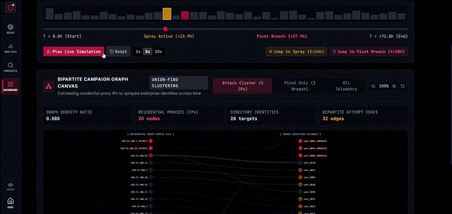
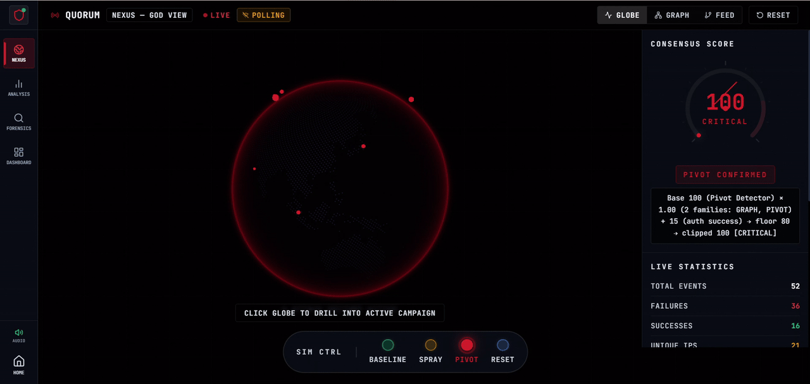
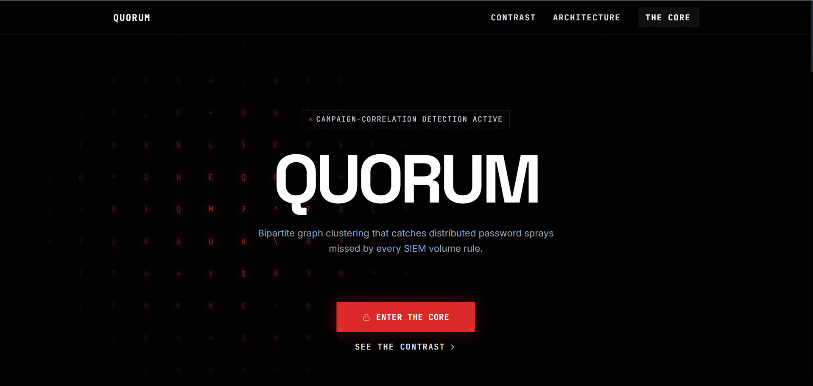
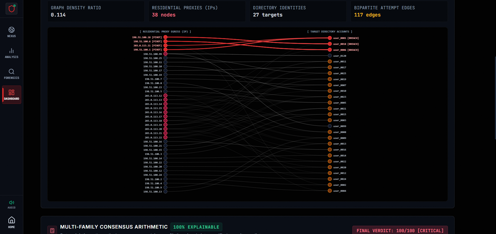
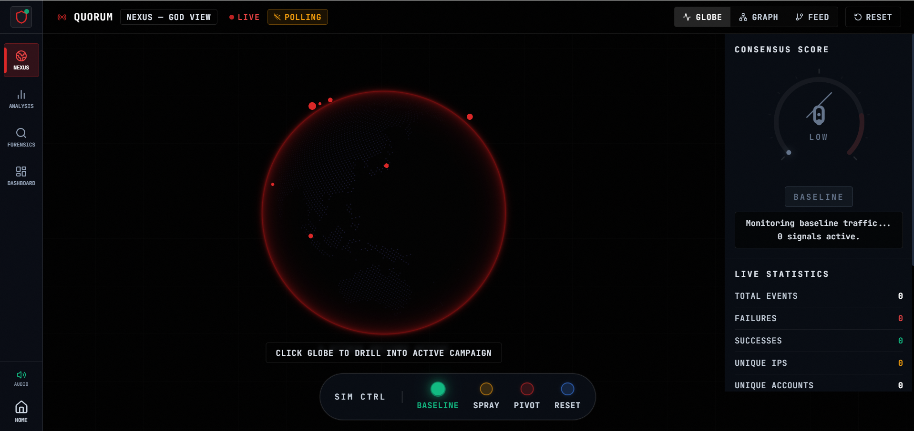
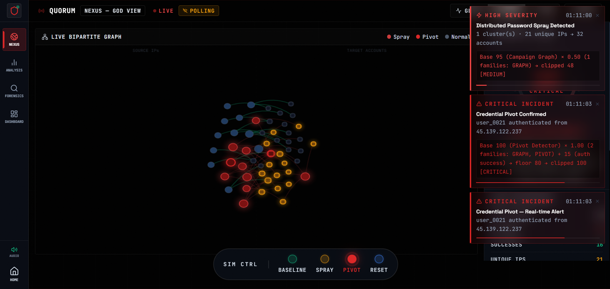
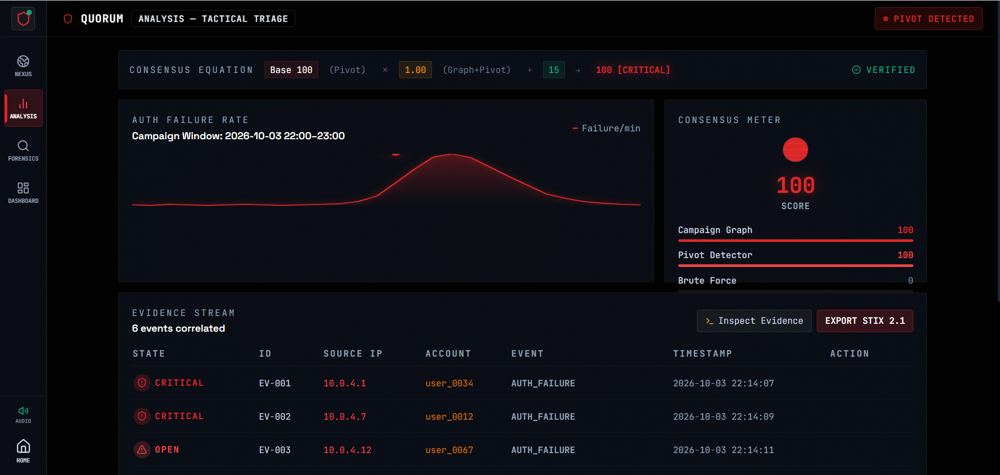
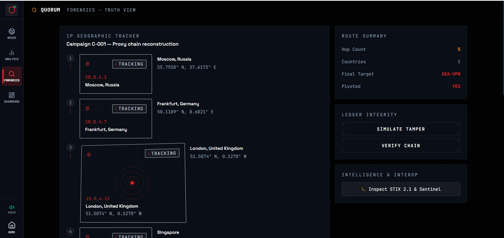
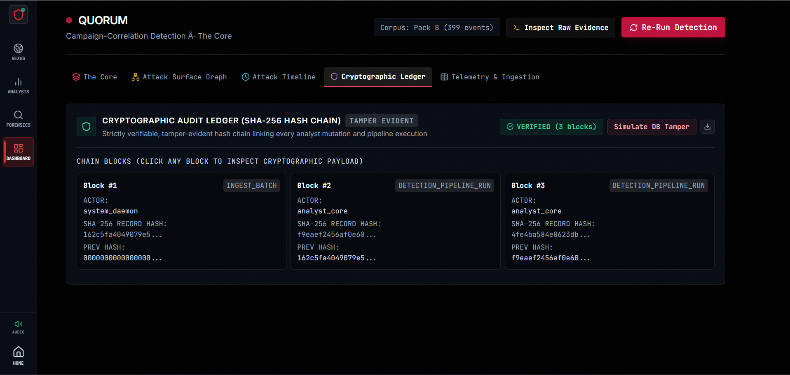
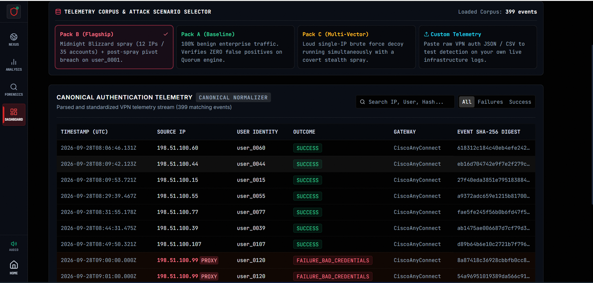

<div align="center">

<!-- HERO GIF -->


<br />

<h1>
  
</h1>

<p>
  <strong>Next-generation enterprise SOC detection layer countering Midnight Blizzard (NOBELIUM) distributed password sprays.</strong><br/>
  Correlates low-and-slow VPN auth telemetry using bipartite graph Union-Find clustering,<br/>
  multi-family consensus arithmetic, and SHA-256 tamper-evident ledgers.
</p>

<!-- BADGES -->
<p>
  <a href="https://github.com/ishangupta1412/Quorum/actions/workflows/ci.yml">
    
  </a>
  &nbsp;
  <a href="https://quorum-soc.vercel.app">
    
  </a>
  &nbsp;
  
  &nbsp;
  
  &nbsp;
  
  &nbsp;
  
  &nbsp;
  
  &nbsp;
  <a href="./LICENSE">
    
  </a>
</p>

<p>
  <a href="https://quorum-soc.vercel.app">
    <strong>🔴 Live Demo → quorum-soc.vercel.app</strong>
  </a>
</p>

<p>
  <a href="https://github.com/ishangupta1412/Quorum">
    
  </a>
</p>

</div>

---

## The 45-Second Demo Contrast

> **The same 10-IP × 47-account Midnight Blizzard spray. Three detectors. One truth.**

<div align="center">

| Detector | Alerts | Outcome |
|:---|:---:|:---|
| 🔴 **Naive Volume Rule** `≥5 failures/IP` | **0** | Complete miss — spray stays below threshold |
| 🟡 **Loosened Threshold** `≥2 failures/IP` | **97** | SOC alert fatigue — floods analysts with noise |
| 🟢 **Quorum Consensus Engine** | **1 Correlated Critical** | `Base 100 (F10_pivot) × 1.00 (GRAPH+PIVOT) + 15 → 100 [CRITICAL]` |

</div>

Quorum uses **bipartite graph Union-Find clustering** + **multi-family consensus arithmetic** to surface exactly **one incident** when NOBELIUM operators distribute a password spray across 10 IPs and 47 accounts — staying under every per-source threshold.

---

## Live Attack Demonstration

### Real-Time Pivot Trigger & Critical Escalation

<div align="center">
  
  <sub><em>Watch Quorum detect a credential compromise pivot in real-time — 0 false positives, 1 correlated critical incident</em></sub>
</div>

---

## Interface Gallery

<table>
  <tr>
    <td width="50%" align="center">
      
      <br/><sub><strong>① Landing Console</strong> — Project overview with live threat feed</sub>
    </td>
    <td width="50%" align="center">
      
      <br/><sub><strong>② Bipartite Topology</strong> — Interactive D3 force-graph, pivot edges highlighted</sub>
    </td>
  </tr>
  <tr>
    <td width="50%" align="center">
      
      <br/><sub><strong>③ Nexus 3D Globe</strong> — Real-time geospatial threat visualization</sub>
    </td>
    <td width="50%" align="center">
      
      <br/><sub><strong>④ Live Simulation</strong> — Animated attack propagation with toast alerts</sub>
    </td>
  </tr>
  <tr>
    <td width="50%" align="center">
      
      <br/><sub><strong>⑤ Tactical Triage</strong> — Per-event evidence stream with severity timeline</sub>
    </td>
    <td width="50%" align="center">
      
      <br/><sub><strong>⑥ IP Tracker</strong> — Geographic attribution and proxy chain reconstruction</sub>
    </td>
  </tr>
  <tr>
    <td width="50%" align="center">
      
      <br/><sub><strong>⑦ Audit Ledger</strong> — SHA-256 hash-chained immutable forensic log</sub>
    </td>
    <td width="50%" align="center">
      
      <br/><sub><strong>⑧ Telemetry Corpus</strong> — Scenario ingestion: Pack A (benign) vs Pack B (attack)</sub>
    </td>
  </tr>
</table>

---

## Architecture

```
┌─────────────────────────────────────────────────────────────────────┐
│                        QUORUM DETECTION PLANE                       │
│                                                                     │
│   Raw JSONL     F2 Normalizer    F5 Burst      F7 Bipartite        │
│   Auth Logs ──► AuthEvent ──────► Detector ──► Graph Cluster       │
│                                                  (Union-Find)       │
│                     F10 Pivot Detector ◄───────────┘               │
│                           │                                         │
│                     F13 Multi-Family                                │
│                     Consensus Engine                                │
│                           │                                         │
│               Correlated Incident (score 0–115)                     │
│                           │                                         │
│           ┌───────────────┴──────────────────┐                     │
│      F21 SHA-256                    F25 Export Suite                │
│      Audit Ledger           STIX 2.1 · Sentinel · CSV              │
└─────────────────────────────────────────────────────────────────────┘
```

### Detection Families

| Family | Signal | Description |
|:---:|:---|:---|
| **F2** | Canonical Normalizer | Strips credentials, unwraps IPv4-mapped IPv6, UTC normalization |
| **F5** | Burst Detector | Single-source high-volume brute-force (>50 failures/15min) |
| **F7** | Spray Detector | Bipartite graph Union-Find: distributed multi-IP → multi-account spray |
| **F10** | Pivot Detector | Post-spray SUCCESS from campaign IP within 2h window (credential compromise) |
| **F13** | Consensus Engine | Multi-family severity score: `Base × Multiplier + PivotBonus` |
| **F15** | Contrast Comparators | Naive vs. Loosened vs. Quorum side-by-side benchmark |
| **F21** | Audit Ledger | SHA-256 hash-chained immutable event log with tamper detection |
| **F25** | Export Suite | STIX 2.1 bundles, Microsoft Sentinel ARM payloads, RFC 4180 CSV |

---

## Quick Start

### Prerequisites

- **Node.js** >= 20 (see [`.nvmrc`](.nvmrc))
- **npm** >= 10

### Installation

```bash
git clone https://github.com/ishangupta1412/Quorum.git
cd Quorum
npm install
```

### Development

```bash
npm run dev          # Start dev server → http://localhost:3000
```

### Verification Loop

```bash
npm run typecheck    # tsc --noEmit  →  zero type errors
npm test             # 55 unit tests  →  all must pass
npm run build        # Production build
```

> All three must pass before any commit lands on `main`.

---

## Pages

| Route | Page | Description |
|:---|:---|:---|
| `/` | Landing | Project overview and live demo entry |
| `/core` | SOC Console | Run detection on Pack A (benign) vs Pack B (attack) |
| `/core/nexus` | Bipartite Graph | Interactive D3 force-graph — click clusters to inspect pivot |
| `/core/analysis` | Evidence Stream | Per-event telemetry with severity timeline |
| `/core/forensics` | Audit Ledger | SHA-256 hash chain with tamper simulation |

---

## API Routes

| Endpoint | Method | Description |
|:---|:---:|:---|
| `/api/v1/sentinel/webhook` | `POST` | Receive Quorum incidents as Microsoft Sentinel ARM payloads (Zod-validated) |
| `/api/v1/export/stix?incidentId=` | `GET` | Download STIX 2.1 bundle for an incident |
| `/api/v1/export/csv?incidentId=` | `GET` | Download RFC 4180 CSV row for an incident |

---

## Security

- **Zero raw credentials** — auth events are stripped of password-shaped fields before normalization
- **Hash-chained audit ledger** — SHA-256 chain; tamper is detectable in O(n)
- **Zod-validated ingestion** — all API inputs validated with strict schemas
- **Server-only secrets** — no service keys ever sent to the browser
- **Red-team tested** — 100k-event burst, 500-IP × 2000-account hostile cluster, timing attacks covered

See [`SECURITY.md`](SECURITY.md) for the vulnerability disclosure policy.

---

## Project Structure

```
quorum/
├── src/
│   ├── app/                    # Next.js App Router pages & API routes
│   │   ├── core/               # SOC console, nexus, analysis, forensics
│   │   └── api/v1/             # Sentinel webhook, STIX & CSV exports
│   ├── components/
│   │   ├── ui/                 # Shared UI: CoreNav, ToastSystem, RawEvidenceModal
│   │   ├── graph/              # Bipartite graph renderer (D3)
│   │   └── sentinel/           # SentinelDispatcher webhook client
│   ├── detect/
│   │   └── engine.ts           # runDetectionPipeline — sealed Pack B
│   ├── lib/
│   │   ├── export/             # stix.ts · sentinel.ts · csv.ts
│   │   ├── sound/              # audio-cues.ts  procedural Web Audio
│   │   └── audit/              # hash-chain ledger
│   ├── data/
│   │   └── generator.ts        # generateSyntheticCorpus (Pack A & B)
│   └── types/
│       └── auth-event.ts       # AuthEvent, Incident, canonical types
├── tests/                      # 55 unit tests (node:test runner)
├── docs/
│   └── assets/
│       ├── recordings/         # Animated GIF demos
│       └── screenshots/        # High-res UI screenshots
├── .github/
│   ├── workflows/ci.yml        # Lint + typecheck + test + build
│   ├── ISSUE_TEMPLATE/         # Bug report & feature request
│   └── PULL_REQUEST_TEMPLATE.md
├── CHANGELOG.md
├── CONTRIBUTING.md
├── CODE_OF_CONDUCT.md
└── SECURITY.md
```

---

## Contributing

See [`CONTRIBUTING.md`](CONTRIBUTING.md) for the full guide.

1. Fork → `git clone` → `npm install`
2. Create a branch: `git checkout -b feat/your-feature`
3. Run `npm run typecheck && npm test` — both must be green
4. Commit using [Conventional Commits](https://www.conventionalcommits.org/): `feat:`, `fix:`, `docs:`, `test:`
5. Open a PR — CI must pass before review

---

## Changelog

See [`CHANGELOG.md`](CHANGELOG.md).

---

## License

MIT © 2026 Ishan Gupta — see [`LICENSE`](LICENSE).

---

<div align="center">
  <sub>Built for <strong>Microsoft Innovate 2026 · Redmond Labs</strong></sub>
</div>
