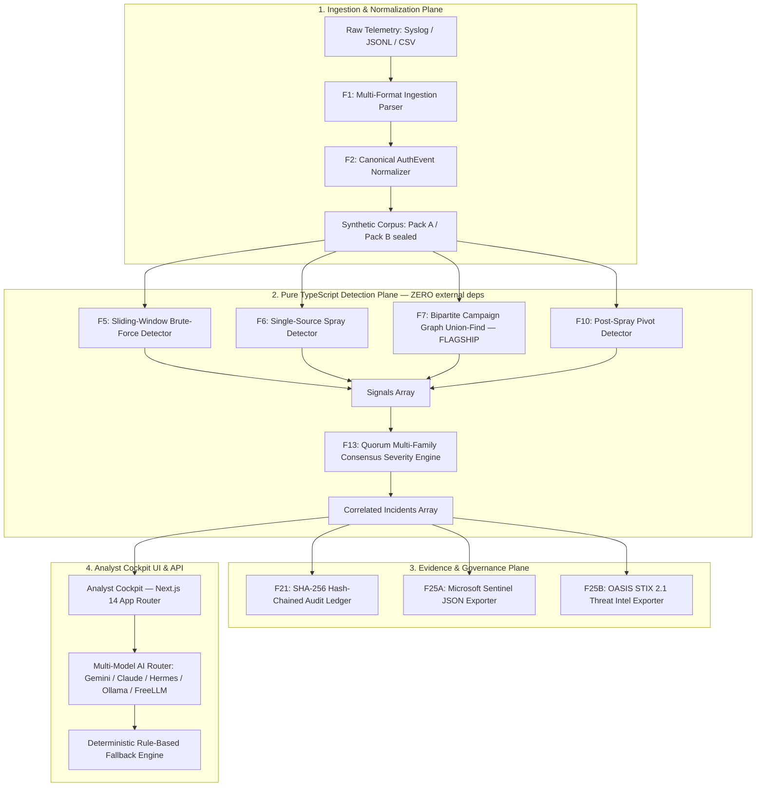

# Quorum — Graphify Knowledge Graph Context
**Project:** Quorum · Campaign-Correlation Detection Layer for VPN Authentication Telemetry  
**Event:** Microsoft Innovate 2026 · Redmond Labs  
**Version:** 4.1.0 (Last sync: 2026-09-29 · All 17 tests passing · TypeScript clean)

> **How to use this doc:** Paste the "Universal Prompt Header" (Section 5) at the top of any task you send to an external AI agent (Freebuff, OpenCode, Claude, Manus, Ollama). The agent receives full type contracts, architectural constraints, and a build-status snapshot — no manual re-explanation needed.

---

## 1. System Architecture (Mermaid Topology)



---

## 2. Build Status (Live Snapshot)

### ✅ Fully Built & Test-Covered

| ID | Feature | File(s) | Tests |
|---|---|---|---|
| F2 | Canonical AuthEvent Normalizer | `src/normalize/parsers.ts` | 7 passing |
| F4 | Deterministic Synthetic Corpus Generator | `src/data/generator.ts` | 2 passing |
| F5 | Sliding-Window Brute-Force Detector | `src/detect/brute-force.ts` | 1 passing |
| F6 | Single-Source Spray Detector | `src/detect/spray-single.ts` | — |
| F7 | Bipartite Graph Union-Find Campaign Clusterer | `src/detect/campaign-graph.ts` | 1 passing |
| F10 | Post-Spray Pivot Detector | `src/detect/pivot.ts` | — |
| F13 | Multi-Family Consensus Severity Engine | `src/detect/consensus.ts` | 1 passing |
| F21 | SHA-256 Hash-Chained Audit Ledger | `src/lib/crypto/audit-ledger.ts` | 2 passing |
| F25A | Microsoft Sentinel JSON Exporter | `src/lib/export/sentinel.ts` | — |
| F25B | OASIS STIX 2.1 Exporter | `src/lib/export/stix.ts` | — |
| — | Detection Engine (orchestrates F5/F6/F7/F10/F13) | `src/detect/engine.ts` | 1 E2E passing |
| — | Multi-Model AI Router (Gemini/Claude/OpenAI/Hermes/Ollama/FreeLLM) | `src/lib/ai/router.ts` | — |
| — | Ingest API Route (rate-limited, 10MB cap, 413 guard) | `src/app/api/v1/ingest/route.ts` | — |
| — | Detect Run API Route | `src/app/api/v1/detect/run/route.ts` | — |
| — | Audit API Route | `src/app/api/v1/audit/route.ts` | — |
| — | AI Query API Route (server-side, keys never reach browser) | `src/app/api/v1/ai/route/route.ts` | — |
| — | Token-Bucket Rate Limiter | `src/lib/rate-limiter.ts` | — |
| — | Analyst Cockpit UI (45-second demo contrast, severity equation, export) | `src/app/page.tsx` | — |
| — | Ralph Loop Regression Tests (3 continuous passes) | `tests/ralph-loop.test.ts` | 3 passing |

**Total: 17/17 tests pass. TypeScript: 0 errors.**

### ⚠️ PRD Features NOT Yet Built (P0 Priority)

| ID | Feature | Priority | Notes |
|---|---|---|---|
| F1 | Multi-Format Log Ingestion (Cisco ASA, Windows Evtlog, Linux auth.log) | P0 | Ingest API route skeleton exists; real parsers not wired |
| F14 | Tuning Workbench UI | P1 | Post-spine |
| F22 | Live Quality Dashboard (Precision/Recall/A2TP metrics display) | P1 | Post-spine |
| F23 | Real-Time Supabase Postgres Integration | P1 | Currently in-memory only |
| F26 | AI Narrative Summarizer (post-severity, clearly labeled) | P1 | Router exists; UI trigger not built |

---

## 3. Core Type Contracts (Source of Truth)

```typescript
// ─── 1. Canonical Auth Event ───────────────────────────────────────────
export interface AuthEvent {
  readonly eventHash: string;      // SHA-256(timestamp|srcIp|userName|outcome) — dedup primary key
  readonly timestamp: string;      // ISO 8601 UTC strictly
  readonly tsTzAssumed: boolean;   // true if timezone was assumed UTC
  readonly srcIp: string;          // IPv4 un-mapped from IPv6 (e.g. 198.51.100.22)
  readonly ipScope: 'public' | 'private'; // RFC1918 classification
  readonly userName: string;       // Stripped of DOMAIN\ and @realm
  readonly userRaw: string;        // Original untouched identifier
  readonly eventOutcome:
    | 'SUCCESS' | 'FAILURE_BAD_CREDENTIALS' | 'FAILURE_LOCKED'
    | 'FAILURE_MFA' | 'FAILURE_EXPIRED' | 'UNKNOWN';
  readonly sourceSystem: string;   // e.g. CiscoAnyConnect, Fortinet, PaloAlto
}

// ─── 2. Detection Signal ───────────────────────────────────────────────
export interface Signal {
  readonly id: string;
  readonly detectorId: 'F5_brute' | 'F6_spray' | 'F7_campaign' | 'F10_pivot';
  readonly detectorFamily: 'VOLUME' | 'STATISTICAL' | 'GRAPH' | 'PIVOT';
  readonly confidenceScore: number; // 0.00 to 1.00
  readonly entityKey: string;      // 'ip:...' | 'user:...' | 'cluster:...'
  readonly eventHashes: readonly string[];
  readonly evidenceBundle: Record<string, unknown>;
}

// ─── 3. Correlated Incident ────────────────────────────────────────────
export interface Incident {
  readonly id: string;
  readonly title: string;
  readonly severityScore: number;  // 0 to 100
  readonly severityTier: 'LOW' | 'MEDIUM' | 'HIGH' | 'CRITICAL';
  readonly severityEquation: string; // e.g. "Base 100 (F10_pivot) × 1.00 (GRAPH+PIVOT) + 15 -> 100 [CRITICAL]"
  readonly familiesPresent: readonly ('VOLUME' | 'STATISTICAL' | 'GRAPH' | 'PIVOT')[];
  readonly signalIds: readonly string[];
  readonly contributingIps: readonly string[];
  readonly targetedAccounts: readonly string[];
  readonly compromisedAccounts: readonly string[];
}

// ─── 4. SHA-256 Audit Record ───────────────────────────────────────────
export interface AuditRecord {
  readonly sequenceId: number;
  readonly timestamp: string;
  readonly actorId: string;
  readonly actionType: string;
  readonly targetEntityType: string;
  readonly targetEntityId: string;
  readonly payloadHash: string;
  readonly prevRecordHash: string; // "0".repeat(64) for genesis block
  readonly recordHash: string;     // SHA-256(prevRecordHash + payloadHash + sequenceId + actorId)
}
```

---

## 4. Flagship Detection Formulae

### The 45-Second Demo Contrast (MEASURED, not estimated)
- **Naive Volume SIEM Rule (F5 alone):** ≥5 failures/IP. Spray stays at 3/IP → **0 alerts.**
- **Loosened Threshold Rule:** ≥2 failures. → **97 false-positive alerts (SOC fatigue).**
- **Quorum Consensus Engine:** Bipartite graph Union-Find → **1 Correlated Critical Incident.**
- **Demo equation printed on screen:** `Base 100 (F10_pivot) × 1.00 (GRAPH+PIVOT) + 15 -> 100 [CRITICAL]`

### F13 Multi-Family Consensus Equation
```
Base        = max(confidenceScore_per_family × 100)
Multiplier  = 0.40 (1 family) | 0.75 (2 families) | 1.00 (≥3 families OR GRAPH+PIVOT)
AdditiveBoost = +15 if compromised account confirmed in cluster
Severity    = min(100, round(Base × Multiplier + AdditiveBoost))
Floor Rule  = If PIVOT family confirmed → Severity ≥ 80 (CRITICAL)
```

---

## 5. Architectural Invariants (NEVER VIOLATE)

1. **Zero External Runtime Dependencies in `src/detect/`** — Pure functional TypeScript. No lodash, ML libs, or math.js.
2. **Zero Raw Credentials Persisted or Logged** — Passwords/hashes stripped before entering the normalizer.
3. **Deterministic Output** — Identical `AuthEvent[]` always produces identical `Incident[]` and hashes.
4. **Anti-Vibecoding UI** — True-black `#000000` canvas, slate `#080C14` cards, 1px borders `rgba(255,255,255,0.08)`, JetBrains Mono for machine data, semantic color for severity only.
5. **LLM Never In Detection Path** — AI Router only used for post-incident narrative summarization (F26), never for scoring.
6. **Server-Side API Keys** — AI provider keys (GEMINI_API_KEY, ANTHROPIC_API_KEY, OPENAI_API_KEY) stay server-side only. Never exposed to browser.

---

## 6. Project File Map

```
Microsoft Innovate/
├── src/
│   ├── app/
│   │   ├── page.tsx                    # Analyst Cockpit UI (45-sec demo, full)
│   │   ├── globals.css                 # Dark theme base styles
│   │   ├── layout.tsx                  # Root layout
│   │   └── api/v1/
│   │       ├── ingest/route.ts         # POST log ingestion (rate-limited, 413-guard)
│   │       ├── detect/run/route.ts     # POST trigger detection pipeline
│   │       ├── audit/route.ts          # GET audit ledger records
│   │       └── ai/route/route.ts       # POST AI query (server-side, secure)
│   ├── detect/
│   │   ├── brute-force.ts              # F5: Sliding-window brute force
│   │   ├── spray-single.ts             # F6: Single-source spray
│   │   ├── campaign-graph.ts           # F7: Union-Find bipartite graph (FLAGSHIP)
│   │   ├── pivot.ts                    # F10: Post-spray pivot detector
│   │   ├── consensus.ts                # F13: Multi-family consensus severity engine
│   │   └── engine.ts                   # Orchestrator: runs F5→F6→F7→F10→F13
│   ├── normalize/
│   │   └── parsers.ts                  # F2: Canonical AuthEvent normalizer
│   ├── data/
│   │   └── generator.ts                # F4: Deterministic synthetic corpus (Pack A/B)
│   ├── lib/
│   │   ├── ai/router.ts                # Multi-model AI router (Gemini/Claude/Hermes/Ollama/FreeLLM)
│   │   ├── crypto/audit-ledger.ts      # F21: SHA-256 hash-chained audit ledger
│   │   ├── export/sentinel.ts          # F25A: Microsoft Sentinel JSON exporter
│   │   ├── export/stix.ts              # F25B: OASIS STIX 2.1 exporter
│   │   └── rate-limiter.ts             # Token-bucket rate limiter
│   └── types/
│       └── ai-router.ts                # AI router type definitions
├── tests/
│   ├── detect.test.ts                  # Core detection + normalizer + audit ledger tests
│   └── ralph-loop.test.ts              # Ralph Loop: 3-pass regression (Pack A, Pack B, tamper)
├── docs/
│   ├── GRAPHIFY_CONTEXT.md             # THIS FILE — share with external AI agents
│   ├── PRD_REVIEW.md                   # PRD checklist & gap analysis
│   ├── DESIGN_DOC.md                   # UI/UX spec & Cockpit component map
│   ├── TECH_STACK.md                   # Full stack decisions & rationale
│   ├── AI_COLLABORATION_GUIDE.md       # How to use each AI agent optimally
│   ├── ANTI_VIBECODE_AUDIT.md          # Pre-flight anti-vibecoding checklist
│   ├── PRE_LAUNCH_CHECKLIST.md         # Security, auth, rate-limit checklist
│   ├── HACKATHON_FRAMEWORK.md          # 45-sec demo script & judge Q&A
│   ├── CODE_STYLE.md                   # Coding conventions
│   ├── DATABASE.md                     # Supabase Postgres schema
│   ├── API_GUIDE.md                    # API endpoint docs
│   └── SECURITY.md                     # Security hardening guide
├── .github/workflows/
│   ├── ci.yml                          # GitHub Actions: typecheck + test on every PR
│   └── reticle-verify.yml              # Reticle: continuous ground-truth regression
├── Quorum_PRD_v4.md                    # Full 1203-line PRD (source of truth)
├── AGENTS.md                           # Operational directives for all AI agents
└── .env.example                        # Required env vars (keys stay server-side)
```

---

## 7. Universal Prompt Header for External AI Delegation

**Copy this block verbatim at the TOP of every task you send to Freebuff / OpenCode / Claude / Manus / Ollama:**

```
[CONTEXT: QUORUM v4.1.0 — Microsoft Innovate 2026 · Redmond Labs]
Project: Enterprise VPN Authentication Campaign-Correlation Plane.
Stack: Next.js 14 App Router, TypeScript strict mode, Vitest/Node test runner.
Detection Plane (src/detect/): Pure functional TypeScript. ZERO external dependencies. Must stay zero-dep.
Build Status: 17/17 tests passing. TypeScript: 0 errors.

Canonical Types (do NOT redefine, import from existing files):
  AuthEvent  → { eventHash, timestamp (UTC), srcIp (IPv4 unmapped), ipScope ('public'|'private'), userName, userRaw, eventOutcome ('SUCCESS'|'FAILURE_BAD_CREDENTIALS'|'FAILURE_LOCKED'|'FAILURE_MFA'|'FAILURE_EXPIRED'|'UNKNOWN'), tsTzAssumed, sourceSystem }
  Signal     → { id, detectorId ('F5_brute'|'F6_spray'|'F7_campaign'|'F10_pivot'), detectorFamily ('VOLUME'|'STATISTICAL'|'GRAPH'|'PIVOT'), confidenceScore (0–1), entityKey, eventHashes[], evidenceBundle }
  Incident   → { id, title, severityScore (0-100), severityTier ('LOW'|'MEDIUM'|'HIGH'|'CRITICAL'), severityEquation (string), familiesPresent[], signalIds[], contributingIps[], targetedAccounts[], compromisedAccounts[] }
  AuditRecord → SHA-256 hash-chained block (see src/lib/crypto/audit-ledger.ts)

Hard Constraints:
  - Zero external runtime deps in src/detect/
  - Zero raw credentials persisted or logged
  - All outputs deterministic (identical input → identical output)
  - UI: true-black #000000, slate #080C14, 1px borders rgba(255,255,255,0.08), JetBrains Mono for machine data
  - Semantic color for severity only: #64748B Low, #F59E0B Medium, #EF4444 High, #DC2626 Critical
  - After ANY code change: run `npm.cmd run typecheck` AND `npm.cmd test` — both must pass before finishing

Verification Loop (MANDATORY before marking task done):
  1. npm.cmd run typecheck   → must exit code 0
  2. npm.cmd test            → must show "pass 17, fail 0" (or higher if you added tests)

[TASK SPECIFICATION BELOW]:
```

---

## 8. Agent Delegation Playbook (Who Does What)

| Task Type | Best Agent | Why |
|---|---|---|
| TypeScript detection plane logic (F5/F6/F7/F10/F13) | **You (main)** | Needs full PRD context + type contracts + test runner access |
| Next.js UI component builds | **You (main)** or **OpenCode** | Cockpit design requires anti-vibecoding rules |
| Supabase schema + RLS policies | **You (main)** or **Claude** | Security-critical; needs DATABASE.md context |
| STIX 2.1 / Sentinel JSON schema validation | **Freebuff** | Security research specialist, good at OASIS specs |
| Red-team "break my app" testing | **Freebuff** | Attack-path enumeration and adversarial input crafting |
| PR review / code quality | **CodeRabbit** (auto) | Already configured in `.coderabbit.yaml` |
| Narrative AI summarization (F26) | **Hermes / Ollama** | LLM narrative; never in scoring path |
| Offline fallback / demo resilience | **Ollama** | Local execution, no API keys needed |
| Judge Q&A prep / pitch narrative | **Manus** | Long-form strategic reasoning |

---

*Last updated: 2026-09-29 | Maintained by: Antigravity (Quorum primary agent) | Auto-synced with every checkpoint.*
